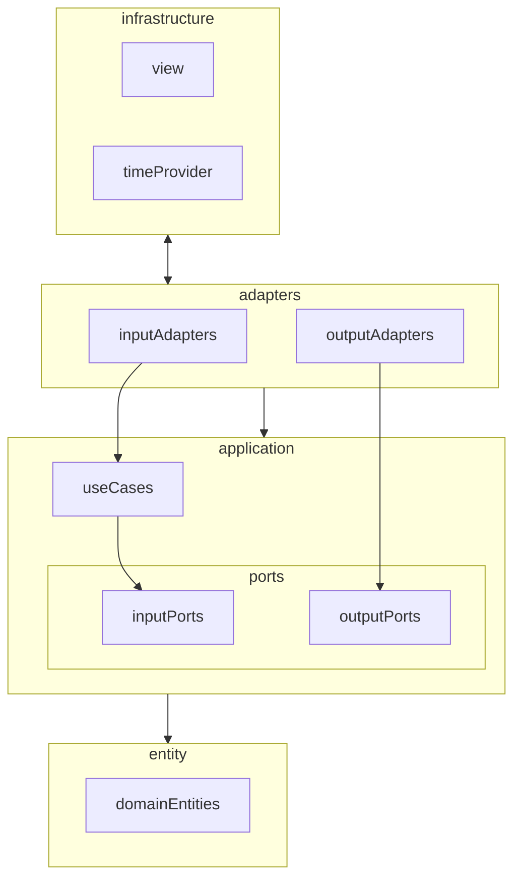

Architettura:

```mermaid
flowchart TB
    subgraph entity
        domainEntities
    end
    subgraph application
        subgraph ports
            inputPorts
            outputPorts
        end
        useCases --> inputPorts    
    end
    subgraph adapters
        inputAdapters --> useCases
        outputAdapters --> outputPorts
    end
    subgraph infrastructure
        view
        timeProvider
    end   
    infrastructure <--> adapters
    adapters --> application
    application --> entity
```
Questa è l'archiettura del progetto.
