# Organizzazione del codice

Il codice è organizzato in 6 package principali:

- entities: contiene le classi che rappresentano le entità del dominio
- applications: include le classi che implementano la logica di business:
    - managers: gestiscono e coordinano le entità in base ai requisiti applicativi
    - ports: definiscono le interfacce attraverso cui la logica di business interagisce con l'esterno
    - useCases: implementano le porte di input, offrendo i servizi esposti dall'applicazione
    - events: definiscono le regole e le operazioni per l'aggiornamento dello stato dell'applicazione

- adapters: contiene i componenti che fungono da interfacce tra la logica di business e i sistemi esterni, adattando
  la comunicazione tra il core e i componenti periferici
- infrastructures: racchiude le classi responsabili della gestione della visualizzazione grafica e i servizi esterni richiesti
- DSL: include le classi che forniscono un linguaggio specifico per la creazione di entità dell'applicazione e per la
  definizione dell'intera railway, semplificando la configurazione del dominio applicativo.
- utils: contiene le classi di utilità che offrono funzioni di supporto, estraendo operazioni comuni utili per lo sviluppo del codice.

## Architettura
Di seguito vengono approfonditi gli elementi dell'architettura che concernono la gestione dello stato.

### AppState

All’interno di applications, la gestione dello stato è delegata ai
`Managers`, ognuno responsabile di un aggregato specifico di entità di dominio.
Ogni manager implementa le operazioni di persistenza, aggiornamento e
cancellazione, assicurando l’integrità dei dati e la gestione degli errori
secondo le regole del dominio applicativo.

### EventQueue

Lo stato dell'applicazione viene gestito nel livello applicativo
dell'architettura esagonale. Questo approccio evita che la
gestione dell'evoluzione dello stato immutabile sia delegata a componenti esterni. In questo
contesto, l'`EventQueue` opera in modo simile ad un event loop, centralizzando il sistema
degli aggiornamenti e mantenendo la coerenza dello stato.

L’`EventQueue` si occupa della gestione dello stato dell’`AppState`, esponendo, in conformità
ai principi di _SRP_ e _ISP_, interfacce specifiche che delimitano le operazioni disponibili
per ogni porzione di dominio. Ogni vista specializzata sull’EventQueue consente
l’esecuzione esclusiva delle azioni pertinenti a un particolare aggregato, garantendo
un accesso controllato e una chiara separazione delle responsabilità nella modifica
dello stato applicativo.

### InputPorts

L’application espone le `InputPorts`, implementate dai rispettivi `Services`,
che rappresentano gli `UseCase` dell’applicazione. Gli `Adapters` invocano queste
porte per richiedere operazioni sul dominio, attivando i servizi che, a loro
volta, pubblicano le operazioni sulla `EventQueue` dedicata al contesto di esecuzione.
Questo meccanismo assicura una gestione coordinata e consistente dello stato,
mantenendo il core domain isolato dalle dipendenze esterne.

```mermaid
classDiagram
    direction TB
    class StationService
    class RouteService
    class TrainServices
    class TimetableServices
    class SimulationInfoServices
    class SimulationServices

    class StationPortsInput
    class RoutePortsInput
    class TrainPortsInput
    class TimetablePortsInput
    class SimulationInfoPortsInput
    class SimulationPortsInput

    class StationEventQueue
    class RouteEventQueue
    class TrainEventQueue
    class TimetableEventQueue
    class TrainEventQueue
    class SimulationEventQueue

    <<Trait>> StationEventQueue
    <<Trait>> RouteEventQueue
    <<Trait>> TrainEventQueue
    <<Trait>> TimetableEventQueue
    <<Trait>> SimulationEventQueue
    <<Trait>> StationPortsInput
    <<Trait>> RoutePortsInput
    <<Trait>> TrainPortsInput
    <<Trait>> TimetablePortsInput
    <<Trait>> SimulationPortsInput
    <<Trait>> SimulationInfoPortsInput
    StationPortsInput: stationMap() Future
    StationPortsInput: addStation() Future
    StationPortsInput: removeStation() Future
    StationPortsInput: updateStation() Future
    RoutePortsInput: routes() Future
    RoutePortsInput: save() Future
    RoutePortsInput: modify() Future
    RoutePortsInput: delete() Future
    TrainPortsInput: rains() Future
    TrainPortsInput: createTrain() Future
    TrainPortsInput: removeTrain() Future
    TrainPortsInput: updateTrain() Future
    TimetablePortsInput: createTimetable() Future
    TimetablePortsInput: deleteTimetable() Future
    TimetablePortsInput: timetablesOf() Future
    SimulationInfoPortsInput: stationInfo() Future
    SimulationInfoPortsInput: routeInfo() Future
    SimulationInfoPortsInput: trainInfo() Future
    SimulationPortsInput: initSimulation() Future
    SimulationPortsInput: initSimulationUsing() Future
    SimulationPortsInput: setupEngine() Future
    SimulationPortsInput: start() Future
    SimulationPortsInput: stop() Future
    SimulationPortsInput: reset() Future
    StationEventQueue <--* StationService: 1
    RouteEventQueue <--* RouteService: 1
    TrainEventQueue <--* TrainServices: 1
    TimetableEventQueue <--* TimetableServices: 1
    SimulationEventQueue <--* SimulationServices: 1
    SimulationEventQueue <--* SimulationInfoServices: 1
    StationPortsInput <|-- StationService
    RoutePortsInput <|-- RouteService
    TrainPortsInput <|-- TrainServices
    TimetablePortsInput <|-- TimetableServices
    SimulationPortsInput <|-- SimulationServices
    SimulationInfoPortsInput <|-- SimulationInfoServices 
```

Come conseguenza della gestione immutabile e centralizzata dell’`AppState` nel livello
application, le implementazioni delle `InputPorts` espongono operazioni che restituiscono
una `Future`. Questo modello consente di elaborare le richieste esterne in modo asincrono,
garantendo che l'aggiornamento dello stato avvenga in maniera controllata e non bloccante,
preservando la coerenza e l'integrità del dominio applicativo.

## Entities

Di seguito viene illustrato il design delle entità di dominio statiche, ovvero quelle
entità che vengono definite e create dall'utente durante la fase di editing, prima
dell'esecuzione della simulazione.

### Station

Di seguito è riportato il modello concettuale della stazione nella fase di definizione,
identificata da un `id`, determinato dalla posizione, e composta dagli attributi specificati
nel diagramma. Sono inoltre definiti due possibili errori di creazione, modellati
tramite il tipo `Error`, a garanzia della validazione dei dati e della coerenza del dominio.

### Route

Le `Route` costituiscono un'entità chiave del dominio e sono identificate da un `IdRoute`,
determinato in funzione della stazione di partenza, della stazione di arrivo e della
tipologia del percorso. Il modello supporta due categorie principali di route:
`Normale` e `AV` (Alta Velocità).
La definizione di una Route comporta l'associazione ad un insieme di Track omogenee
rispetto alla tipologia selezionata. Il processo di creazione è vincolato da regole
di integrità, con la gestione degli errori formalizzata attraverso l'enumerazione
`Errors`, che consente di intercettare e rappresentare eventuali anomalie durante la
fase di validazione.

### Train

Il `Train` viene identificato dal suo _name_ e si caratterizza per la sua tecnologia 
`TrainTechnology` che gli conferisce specifiche capacità di movimento come l'accelerazione 
di partenza/arresto e la massima velocità che poi verranno utilizzate per l'elaborazione delle
`Timetable`. Può comporsi di diversi `Wagon` tutti con una specifica capienza, tipologia e lunghezza.

### Timetable

L'entità `Timetable` assume un ruolo cruciale per la programmazione dei diversi viaggi che i treni devono
svolgere durante la simulazione. Attraverso una sequenza di `Station` e di `Route` viene definita la tabella
oraria del treno dove per ogni station viene memorizzato un `TrainStationTime`contenente l'ora di arrivo/partenza e gli eventuali minuti di sosta.

Una `Timetable` può essere costruita attraverso il `TimetableBuilder` utilizzando il *Builder Pattern* e
attraverso i metodi che espone è possibile ricavare una `PartialTimetable`o, quando viene la fornita la stazione finale, una `Timetable`.
Si noti che nell' UML sottostante il builder utilizza un
`TimeEstimator` che fornisce una strategia specifica per il calcolo degli orari ([maggiori dettagli](5-impl-violani.md#timetable)).

## View

Per lo sviluppo della `view`, sono stati progettati componenti personalizzati per
migliorare l'esperienza dell'utente, ottimizzando l'interazione con l'interfaccia.
La progettazione è stata guidata dal principio _SRP_ (Single Responsibility Principle),
con l'obiettivo di ridurre la complessità e la verbosità, delegando a ciascun
componente una responsabilità chiara e specifica nella gestione della creazione grafica.

### Timetable View
L'interfaccia grafica della timetable è composta da una classe *root* la `TimetableView` e due sottoschermate figlie: `EditorTab` e `TimetableViewTab` le quali fanno uso della `TimetableListView` per la visualizzazione delle Timetable sia in fase di creazione che di consultazione. Le due schermate figlie aderiscono al contratto `TrainsUpdatable` mentre solo la `TimetableViewTab` aderisce anche a `TimetablesUpdatable`.

Il `TimetableViewAdapter` (omesso in questo uml) comunica attraverso questi contratti con le schermate permettendo l'aggiornamento dei dati da visualizzare in modo asincrono.

### Adapters
La `View` comunica con la logica di business tramite `InputAdapter`, che fungono
da intermediari tra l’interfaccia utente e il core applicativo.
Questi adapter sono progettati per garantire un’integrazione efficiente
e trasparente, esponendo i servizi dell’applicazione in conformità alle
`InputPort` definite a livello applicativo.

Parallelamente, l’applicazione utilizza un `SimulationNotificationListener`
per propagare eventi dal dominio verso la `view`. In questo contesto, l’adapter
`SimulationNotificationAdapter` si occupa di tradurre le notifiche provenienti
dalla logica di business in un formato compatibile con i componenti grafici,
assicurando un corretto aggiornamento dell’interfaccia in risposta agli eventi
della simulazione.

### Observers

Per quanto riguarda l'interazione con l'utente, è stato adottato il pattern Observer
per monitorare gli eventi grafici, come le azioni del mouse sulla GUI.
Questo approccio consente di osservare gli eventi in tempo reale e, quando
necessario, trasformarli in valori utili per l'applicazione.
Grazie a questo pattern, l'interazione diventa agile, estendibile e facilmente
manutenibile, permettendo una gestione dinamica degli input utente.

### Decorator

La view dell'applicazione è stata progettata per garantire un impatto visivo chiaro
e migliorato, utilizzando il pattern Decorator. Questo pattern permette di
estendere i componenti grafici nativi senza modificarne la struttura originale,
migliorando la resa grafica complessiva. In questo modo, è stato possibile
arricchire l'interfaccia con funzionalità visive aggiuntive, mantenendo al
contempo la modularità e la riusabilità dei componenti di base.

## Railway simulator

La parte centrale del progetto riguarda la simulazione della rete ferroviaria, in questa sezione sarà descritta
nel dettaglio questa parte di architettura.

### Entities

Dato che si è sviluppato un simulatore *Agent-Based* la prima suddivisione che si definisce per le entità è quella di:

- Environment: lo spazio in cui gli agenti esistono e operano
- Agents: le entità autonome del sistema che interagiscono con l'ambiente attraverso un processo continuo di
  sense-decice-act

Il componente di base per l'Environment è l'`EnvironmentElement` che può a sua volta contenere o meno degli `Agents`.
Nel caso in cui contenga degli agents questo farà utilizzo di un `SimulationAgentsContainer`. Per limitare la complessità
necessaria
alla modellazione del sistema si è scelto di costruire la gerarchia dei `SimulationAgentsContainer` a partire dai
`TrainAgent`
definendo il componente `TrainAgentsContainer`. Tra questi container sono stati definiti:

- **Platform**: container che rappresenta una rotaia della Station, occupabile da un treno alla volta
- **Track**: container che rappresenta una rotaia di una Route. Dato che può essere utilizzata
  da più treni contemporaneamente è stato necessario definirne il verso di percorrenza

In particolare l'entità `TrainAgent` presenta uno
`StateBehavior` per caratterizzare i diversi stati del treno. Le informazioni del moto del treno vengono incapsulate all'interno di `MotionData` e vengono aggiornate ad ogni step della simualzione in base al comportamento attuale in cui si trova il treno.

Complessivamente gli `EnvironmentElement` sono:

- **StationEnvironmentElement**: rappresenta una `Station` nell'ambito della simulazione, ed è composta da una o più
  `Platform`
- **RouteEnvironmentElement**: rappresenta una `Route` nell'ambito della simulazione, ed è composta da una o più `Track`
- **DynamicTimetable**: rappresenta una `Timetable` nell'ambito della simulazione. Rispetto alla controparte statica è
  composta da una tabella con gli orari effettivi e offre funzionalità per l'aggionamento di quest'ultima

Si può notare l'applicazione del principio `SRP` in quanto ogni entità legata alla simulazione
estende le funzonalità della controparte statica ed inoltre anche nel caso degli `EnvironmentElement`, come si può
notare dai grafici riportati, ogni elemento della gerarchia si occupa di effettuare uno specifico sotto insieme di
controlli.

Gli `EnvironmentElement` sono a loro volta raggruppati in `Environment` così da agevolarne la gestione. Anche in questo caso, nel caso in cui questi contengano dei `SimulationAgent` per motivi analoghi a
quelli precedenti,
la gerarchia parte dal considerare i `TrainAgentEnvironment`.

In particolare il `DynamicTimetableEnvironment` è responsabile della ricerca e aggiornamento delle `DynamicTimetable` a
partire da un `TrainAgent`, un `ClockTime` e una funzione di update.

Riguardo i `TrainAgentEnvironment` si trovano invece:

- **StationEnvironment**: responsabile della gestione dei `TrainAgent` negli `StationEnvironmentElement`, in particolare
  per l'ingresso e uscita dei `Train` dalle `Platform`

- **RouteEnvironment**: responsabile della gestione dei `TrainAgent` nei `RouteEnvironmentElement`, in particolare per
  il movimento dei `Train` e per l'ingresso e uscita dalle `Track`

A conclusione della modellazione della gerarchia delle entità della simulazione si trova l'`EnvironmentCoordinator` che
si occupa di coordinare l'aggiornamento dei diversi `SimulationAgents` e le successive operazioni di aggiornamento
all'interno dei diversi `Environment`.
I `SimulationAgents` a loro volta si aggiorneranno in ogni step basandosi sulle informazioni fornite dall'
`EnvironmentCoordinator`. Per rappresentare il nostro dominio è stato definito un particolare tipo di coordinatore: il
`RailwayEnvironment`.

### Simulation Engine

L'Engine è il cuore del sistema di simulazione, responsabile del suo avanzamento temporale.

#### Entities

Lo stato della simulazione è mantenuto attraverso due strutture dati dedicate:

- **EngineState**: traccia l'ultimo aggiornamento, l'ultimo delta temporale e il tempo di ciclo accumulato.

- **SimulationData**: contiene informazioni sullo step corrente, sul tempo di simulazione trascorso e sullo stato del
  `RailwayEnvironment`.

#### Application

A livello dell'applicazione è presente il `SimulationManager`, che comunicando con un `TimeProvider` 
e avendo la capacità di inviare notifiche attraverso un `SimulationPortsOutput`
ha il compito di coordinare le varie entità della simulazione e gestirne attivamente l'avanzamento.

Per quanto riguarda il `SimulationPortsOutput` risulta banale la sua implementazione come output port, definendo una ben
chiara necessità di interazione con l'esterno.
Il `TimeProvider` invece si è scelto di definirlo come porta di output, nonostante si sarebbe potuta usare internamente
l'ulility `System.currentTimeMillis()`, per mantenere le fonti di randomicità all'esterno, rispettando così i principi
dell'architettura esagonale e agevolando il successivo testing dell'engine attraverso un `MockedTimeProvider`

