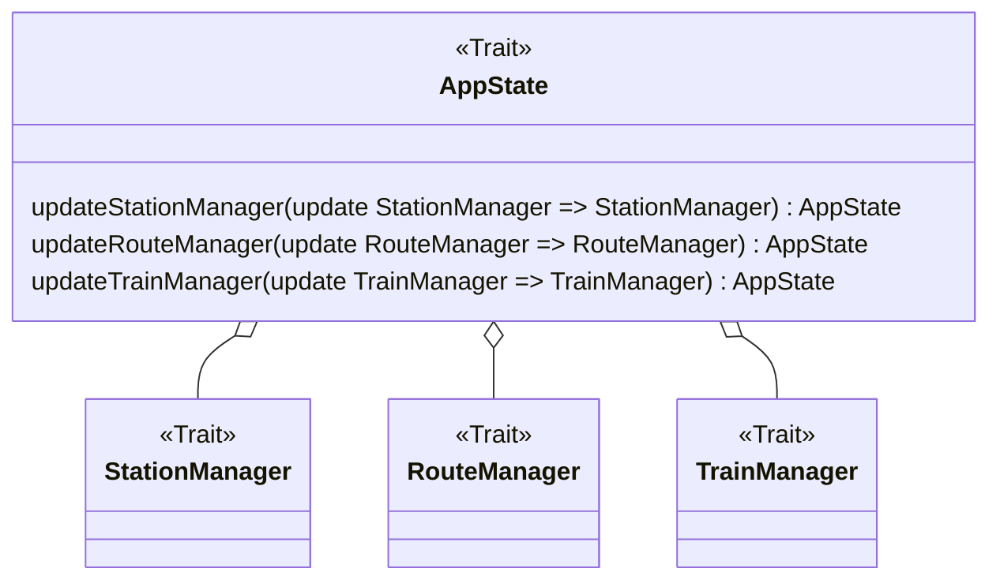
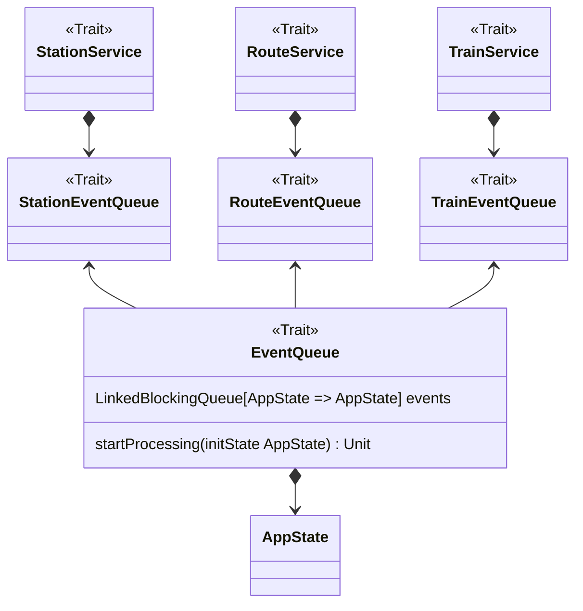
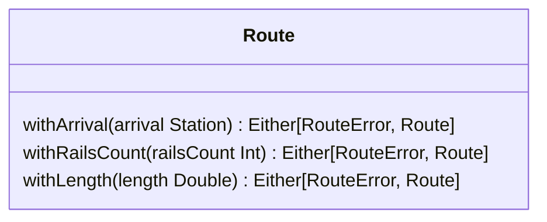

# Manuel Buizo

Il codice implementato durante l’esecuzione del progetto è stato prevalentemente indirizzato alle seguenti aree
funzionali:

- Gestione dell’immutabilità e dei meccanismi di aggiornamento dello stato dell’applicazione
- Implementazione dell’entry point e gestione delle porte di comunicazione con i componenti applicativi
- Progettazione, costruzione e validazione delle entità route
- Definizione e creazione degli elementi infrastrutturali tramite Domain-Specific Language (DSL)
- Progettazione e implementazione dell’interfaccia grafica utente (GUI), inclusa la visualizzazione della mappa e la
  gestione degli eventi interattivi
- Rendering grafico della simulazione, comprensivo di stazioni route e train

Di seguito si propone un’analisi più approfondita delle componenti più rilevanti.

## Immutabilità e aggiornamento dello stato dell'applicazione: `AppState`

**Obiettivo**: Creare uno stato immutabile dell'applicazione e garantire
la sua coerenza e integrità.

**Motivazione**: L'adozione di funzioni per la modifica dello stato, anziché
interventi diretti, promuove una gestione funzionale basata sull'immutabilità
e riduce i side effects.
Questo approccio semplifica il testing e garantisce un controllo più rigoroso
e una maggiore coerenza nella gestione dello stato.

### Componente

Di seguito è mostrata una rappresentazione parziale delle classi che compongono `AppState`.



### Descrizione tecnica

Sfruttando la funzione `copy` delle case class di Scala, è possibile creare un nuovo
stato dell'applicazione a partire da uno stato precedente, modificando solo le parti
interessate. Le funzioni di aggiornamento dello stato, definite all'interno della classe
`AppState`, accettano come argomento una funzione che modifica i componenti interessati.

```Scala 3
override def updateStationManager(update: StationManager => StationManager): AppState =
  copy(stationManager = update(stationManager))

override def updateRoute(update: RouteManager => RouteManager): AppState =
  copy(routeManager = update(routeManager))
```

## Entry point e Porte dell'Architettura Esagonale: `EventQueue`

**Obiettivo**: Implementare un sistema di comunicazione per leggere e aggiornare
lo stato dell'applicazione (`AppState`) dell'esterno, preservando l'immutabilità.

**Motivazione**: Gestire in modo efficiente e sicuro le interazioni tramite le porte
dell'architettura esagonale, implementando un sistema di comunicazione robusto e
scalabile, che assicura una gestione funzionale della creazione e dell'aggiornamento
dello stato dell'applicazione.
// dire high-order type

### Componente

La definizione di una coda dedicata per ciascun concetto di `Service` consente di aderire
ai principi di *Single Responsibility SRP* e *Dependency Inversion DIP*, assicurando
alta coesione e basso accoppiamento. Questo approccio favorisce la modularità e migliora
la scalabilità dell'architettura.  
Di seguito è riportata una porzione delle classi coinvolte.



### Descrizione tecnica

L'`EventQueue` è una coda bloccante di funzioni che aggiornano lo stato dell'applicazione.
Il metodo `startProcessing` utilizza` LazyList.continually` per estrarre continuamente
eventi dalla coda. Ogni evento, rappresentato da una funzione, viene applicato
allo stato corrente tramite `foldLeft`, producendo una nuova versione immutabile dello
stato ad ogni iterazione.
// dire high-order type

```Scala 3
override def startProcessing(initState: AppState): Unit =
  LazyList.continually(events.take).foldLeft(initState)((state, fun) => fun(state))
```

## Entità route: `Route`

**Obiettivo**: Progettare e implementare le entità che rappresentano i percorsi
tra le stazioni, assicurando che la creazione delle rotte avvenga secondo vincoli
di validità definiti.

**Motivazione**: Definire un sistema per la creazione delle `Route` che garantisca
una costruzione sicura e funzionale dell'entità, sfruttando le capacità di Scala
per la gestione degli errori e la validazione dei dati in modo dichiarativo.

### Componente

Di seguito sono riportate alcune funzionalità per la modifica e la
validazione dei campi di `Route`.



### Descrizione tecnica

// Alias per il tipo di error
Spiegare che

```scala 3
type RouteError = NonEmptyChain[Errors]

object Route:
  def apply(departure: Station, arrival: Station, typeRoute: RouteType,
            railsCount: Int, length: Double): Either[RouteError, Route] =
    validateAndCreateRoute(departure, arrival, typeRoute, railsCount, length)
```

```scala 3
private def validateRoute[T](departure: Station, arrival: Station,
                             typeRoute: RouteType, railsCount: Int,
                             length: Double,
                             creation: (Station, Station, RouteType, Int, Double) => T
                            ): Either[RouteError, T] = (
  validateStation(departure, arrival),
  validateStation(arrival, departure),
  validateRailsCount(railsCount, departure, arrival),
  validateLength(length, departure, arrival))
  .mapN(creation(_, _, typeRoute, _, _))
```

```scala 3
extension [A, E](value: A)
  def cond(f: A => Boolean, error: E): Either[E, A] =
    Either.cond(f(value), value, error)

  def validateChain(f: (A => Boolean, E)*): Either[NonEmptyChain[E], A] =
    f.map(value.cond).traverse(_.toValidatedNec).map(_ => value).toEither
```

## DSL per la creazione di entità infrastrutturali: `Station` `Route` `Train`

**Obiettivo**

**Motivazione**

### Componente

```mermaid
```

### Descrizione tecnica

```scala 3
implicit class AppStateOps(start: CreateAppState.type):
  @targetName("To put element on app state") @targetName("")
  def ++(appState: AppState): AppStateDSL = AppStateDSL(appState)

  @targetName("To create route")
  def ->(appState: AppState): AppStateDSL = AppStateDSL(appState)
```

```scala 3
object CreateAppState:
  final case class AppStateDSL(var appState: AppState)

  final case class WithDeparture(var appState: AppState, departure: Station)

  final case class WithRouteType(var appState: AppState, departure: Station, routeType: Routes.RouteType)

  final case class WithPlatform(var appState: AppState,
                                departure: Station,
                                routeType: Routes.RouteType,
                                platform: Int)

  final case class WithLength(var appState: AppState,
                              departure: Station,
                              routeType: Routes.RouteType,
                              platform: Int,
                              length: Double)

  val state = AppState()
  CreateAppState || state set departure set arrival
  CreateAppState || state link routeA link routeB
  CreateAppState || state put trainA put trainB
```

```scala 3
given Conversion[AppStateDSL, AppState] = _.appState
```

```scala 3
val initState = AppState()
appState = CreateAppState || initState set
  stationA set stationB set stationC set stationD set stationE set
  routeFG link routeGA link routeAB link routeBC link routeCD link
  trainA_AV put trainB_AV put trainC_AV put trainD_AV scheduleA
  table9 scheduleA table10 scheduleA table11 scheduleA table12
```

## Toolkit per la Customizzazione Visiva dell'UI: `EnhancedLook`

**Obiettivo**

**Motivazione**

### Componente

```mermaid
```

### Descrizione tecnica

```scala 3
trait EnhancedLook extends Component:
  self: Component =>

  def updateGraphics(): Unit =
    revalidate()
    repaint()

  protected def paintLook(g: Graphics2D): Unit = ()

  override protected def paintComponent(g: Graphics2D): Unit =
    g.setRenderingHint(RenderingHints.KEY_ANTIALIASING, RenderingHints.VALUE_ANTIALIAS_ON)
    g.setRenderingHint(RenderingHints.KEY_RENDERING, RenderingHints.VALUE_RENDER_QUALITY)
    paintLook(g)
    super.paintComponent(g)
```

```scala 3
trait ShapeEffect extends EnhancedLook:
  private var _rect: Styles.Rect = Styles.defaultRect
  private val currentColor: CurrentColor = CurrentColor(rectPalette.background)

  override protected def paintLook(g: Graphics2D): Unit =
    super.paintLook(g)
    g.setColor(currentColor.current)
    val clipShape =
      new RoundRectangle2D.Float(0, 0, size.width.toFloat, size.height.toFloat, rect.arc.toFloat, rect.arc.toFloat)
    g.setClip(clipShape)
    g.fillRoundRect(0, 0, size.width, size.height, rect.arc, rect.arc)
```

### Pattern

## Event system dei componenti grafici: `Observable` `Observer`

**Obiettivo**

**Motivazione**

### Componente

```mermaid

```

### Descrizione tecnica

// export e componente gia fatto per l'observable

```scala 3
def toObserver[I](newData: I => T): Observer[I]
```

### Pattern

### testing della route adapter

### testing dell'architettura

**Obiettivo**

**Motivazione**

### Componente

### Descrizione tecnica

### Pattern

### Testing

### Criticità
