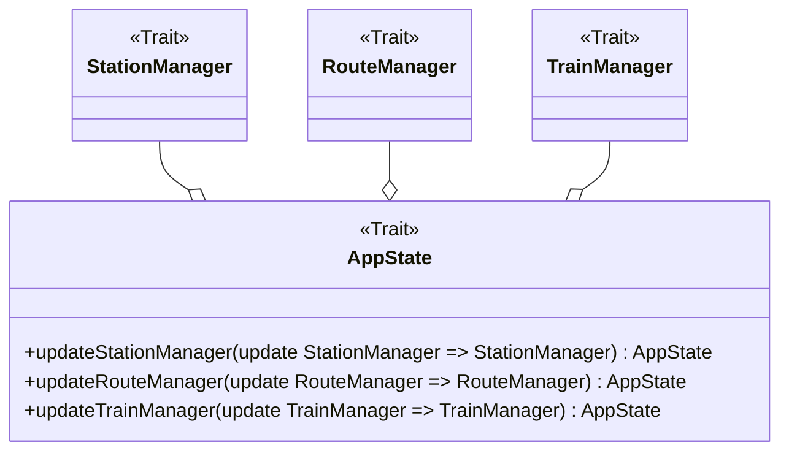
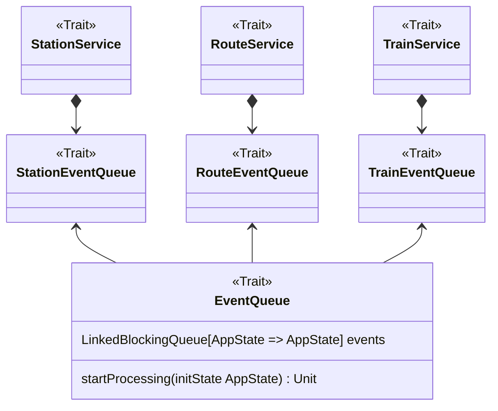

# Manuel Buizo

Il codice implementato durante l’esecuzione del progetto è stato prevalentemente indirizzato alle seguenti aree
funzionali:

- Gestione dell’immutabilità e dei meccanismi di aggiornamento dello stato dell’applicazione
- Implementazione dell’entry point e gestione delle porte di comunicazione con i componenti applicativi
- Progettazione, costruzione e validazione delle entità route
- Definizione e creazione degli elementi infrastrutturali tramite Domain-Specific Language (DSL)
- Progettazione e implementazione dell’interfaccia grafica utente (GUI), inclusa la visualizzazione della mappa e la
  gestione degli eventi interattivi
- Rendering grafico della simulazione, comprensivo di stazioni route e train

Di seguito si propone un’analisi più approfondita delle componenti più rilevanti.

## Immutabilità e aggiornamento dello stato: `AppState`

**Obiettivo**: Creare uno stato immutabile dell'applicazione e garantire la sua coerenza e integrità.

**Motivazione**: L'adozione di funzioni per la modifica dello stato, anziché interventi
diretti, promuove un'architettura immutabile. Questo approccio riduce i side effects,
facilita il testing e assicura un controllo più rigoroso sulla gestione dello stato,
garantendo coerenza e prevedibilità.

### Componente



### Descrizione tecnica

Sfruttando la funzione `copy` delle case class di Scala, è possibile creare un nuovo
stato dell'applicazione a partire da uno stato precedente, modificando solo le parti
interessate. Le funzioni di aggiornamento dello stato, definite all'interno della classe
`AppState`, accettano come argomento una funzione che modifica i componenti interessati.

```Scala 3
override def updateStationManager(update: StationManager => StationManager): AppState =
  copy(stationManager = update(stationManager))

override def updateRoute(update: RouteManager => RouteManager): AppState =
  copy(routeManager = update(routeManager))
```

## Entry point e porte di comunicazione: `EventQueue`

**Obiettivo**: Implementare un sistema di comunicazione per leggere e aggiornare
lo stato dell'applicazione dell'esterno, preservando l'immutabilità.

**Motivazione**: Gestire in modo efficiente e sicuro le interazioni tramite le porte
dell'architettura esagonale, implementando un sistema di comunicazione robusto e
scalabile, che assicura una gestione funzionale della creazione e dell'aggiornamento
della simulazione.

### Componente

La definizione di una coda dedicata per ciascun concetto di service consente di aderire
ai principi di Single Responsibility (SRP) e Dependency Inversion (DIP), assicurando
alta coesione e basso accoppiamento. Questo approccio favorisce la modularità e migliora
la scalabilità dell'architettura.



### Descrizione tecnica

L'`EventQueue` è una coda bloccante di funzioni che aggiornano lo stato dell'applicazione.
Il metodo `startProcessing` utilizza` LazyList.continually` per estrarre continuamente
eventi dalla `EventQueue`. Ogni evento, rappresentato da una funzione, viene applicato
allo stato corrente tramite `foldLeft`, producendo una nuova versione immutabile dello
stato ad ogni iterazione.

```Scala 3
override def startProcessing(initState: AppState): Unit =
  LazyList.continually(events.take).foldLeft(initState)((state, fun) => fun(state))
```

## creazione della route: validation dei campi

## DSL per la creazione della railway

## mixin decorator: graphics

# observer gui pattern

# testing della route adapter

**Obiettivo**

**Motivazione**

### Componente

### Descrizione tecnica

### Pattern

### Testing

### Criticità
