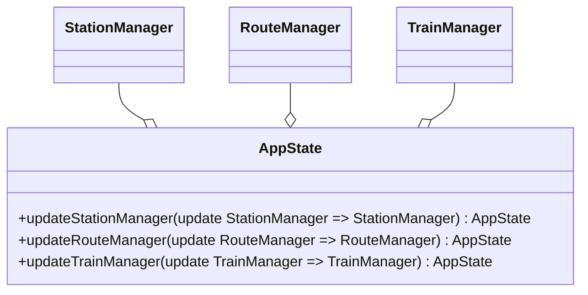

# Manuel Buizo

Il codice implementato durante l’esecuzione del progetto è stato prevalentemente indirizzato alle seguenti aree
funzionali:

- Gestione dell’immutabilità e dei meccanismi di aggiornamento dello stato dell’applicazione
- Implementazione dell’entry point e gestione delle porte di comunicazione con i componenti applicativi
- Progettazione, costruzione e validazione delle entità route
- Definizione e creazione degli elementi infrastrutturali tramite Domain-Specific Language (DSL)
- Progettazione e implementazione dell’interfaccia grafica utente (GUI), inclusa la visualizzazione della mappa e la
  gestione degli eventi interattivi
- Rendering grafico della simulazione, comprensivo di stazioni route e train

Di seguito si propone un’analisi più approfondita delle componenti più rilevanti.

## Immutabilità e aggiornamento dello stato: `AppState`

**Obiettivo**: Creare uno stato immutabile dell'applicazione e garantire la sua coerenza e integrità.

**Motivazione**: L'adozione di funzioni per la modifica dello stato, anziché interventi
diretti, promuove un'architettura immutabile. Questo approccio riduce i side effects,
facilita il testing e assicura un controllo più rigoroso sulla gestione dello stato,
garantendo coerenza e prevedibilità.

### Componente

### Descrizione tecnica

### Pattern

### Testing

### Criticità

## mixin decorator: graphics

# creazione della route: validation dei campi

# DSL per la creazione della railway

# appState -> eventQueue -> SRP -> Listlazy

# testing della route adapter

# observer gui pattern
