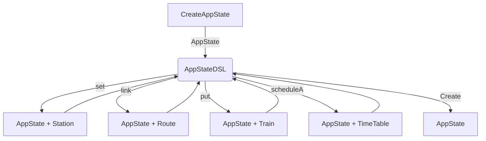
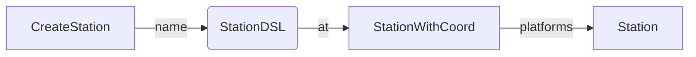

# Implementazione - Buizo Manuel 

Il codice implementato durante l’esecuzione del progetto è stato prevalentemente indirizzato alle seguenti aree
funzionali:

- Gestione dell’immutabilità e dei meccanismi di aggiornamento dello stato dell’applicazione

- Implementazione dell’entry point e gestione delle porte di comunicazione con i componenti applicativi
- Progettazione, costruzione e validazione delle entità `Route`
- Definizione e creazione degli elementi infrastrutturali tramite Domain-Specific Language (DSL)
- Progettazione e implementazione dell’interfaccia grafica utente (GUI), inclusa la visualizzazione della mappa e la
  gestione degli eventi interattivi
- Rendering grafico della simulazione, comprensivo di Stazioni Route e Train

Di seguito si propone un’analisi più approfondita delle componenti più rilevanti.

## Immutabilità e aggiornamento dello stato dell'applicazione: `AppState`

**Obiettivo**: Creare uno stato immutabile dell'applicazione e garantire
la sua coerenza e integrità.

**Motivazione**: L'adozione di funzioni *higher-order* per la modifica dello stato, anziché tramite interventi diretti, promuove una gestione funzionale basata sull'immutabilità e riduce i side effects.
Questo approccio semplifica il testing e garantisce un controllo più rigoroso
e una maggiore coerenza nella gestione dello stato.

### Descrizione tecnica
 Le funzioni di aggiornamento dello stato, definite all'interno della classe `AppState`, accettano come argomento una funzione che modifica i componenti interessati sfruttando la funzione `copy`.

```Scala 3
override def updateStationManager(update: StationManager => StationManager): AppState =
  copy(stationManager = update(stationManager))

override def updateRoute(update: RouteManager => RouteManager): AppState =
  copy(routeManager = update(routeManager))
```

## Entry point e Porte dell'Architettura Esagonale: `EventQueue`

**Obiettivo**: Implementare un sistema di comunicazione per leggere e aggiornare
lo stato dell'applicazione (`AppState`) dall'esterno, preservando l'immutabilità.

**Motivazione**: Gestire in modo efficiente e sicuro le interazioni tramite le porte
dell'architettura esagonale, implementando un sistema di comunicazione robusto e
scalabile, che assicuri una gestione funzionale della creazione e dell'aggiornamento
dello stato dell'applicazione.

### Descrizione tecnica

L'`EventQueue` è una coda concorrente di funzioni che aggiornano lo stato dell'applicazione.
Il metodo `startProcessing` utilizza la `LazyList.continually` per estrarre continuamente
eventi dalla coda. Ogni evento, rappresentato da una funzione, viene applicato
allo stato corrente tramite `foldLeft`, producendo una nuova versione immutabile dello
stato ad ogni iterazione. Questo approccio è reso possibile dall'aggiornamento
di `AppState` tramite l'uso di funzioni _higher-order_.

```Scala 3
override def startProcessing(initState: AppState): Unit =
  LazyList.continually(events.take).foldLeft(initState)((state, fun) => fun(state))
```

## Entità route: `Route`

**Obiettivo**: Progettare e implementare le entità che rappresentano i percorsi
tra le stazioni, assicurando che la creazione delle Route avvenga secondo vincoli
di validità definiti.

**Motivazione**: Definire un sistema per la creazione delle `Route` che garantisca
una costruzione sicura e funzionale dell'entità, sfruttando le capacità di Scala
per la gestione degli errori e la validazione dei dati in modo dichiarativo.

### Descrizione tecnica

Per implementare il sistema di validazione, è stato utilizzato il tipo `Either`,
che consente di gestire in modo funzionale ed espressivo i possibili errori.
Il companion object di `Route` espone il metodo apply, che accetta i parametri
necessari per la creazione di una Route e restituisce un `Either[RouteError, Route]`,
restituendo l'entità `Route` in caso di successo o un `RouteError` ovvero una lista
di errori in caso di fallimento.

```scala 3
type RouteError = NonEmptyChain[Errors]

object Route:
  def apply(departure: Station, arrival: Station, typeRoute: RouteType,
            railsCount: Int, length: Double): Either[RouteError, Route] =
    validateAndCreateRoute(departure, arrival, typeRoute, railsCount, length)
```

La funzione `validateAndCreateRoute` si occupa di validare i parametri di input
concatenando i risultati Either ottenuti nelle singole funzioni di validazione tramite
l'operatore `mapN` di `cats`. Questo permette di creare una `Route` solo se tutti
i controlli vengono superati, permette anche di avere una lista di errori in
caso di fallimento.

```scala 3
private def validateRoute[T](departure: Station, arrival: Station,
                             typeRoute: RouteType, railsCount: Int,
                             length: Double,
                             creation: (Station, Station, RouteType, Int, Double) => T
                            ): Either[RouteError, T] = (
  validateStation(departure, arrival),
  validateStation(arrival, departure),
  validateRailsCount(railsCount, departure, arrival),
  validateLength(length, departure, arrival))
  .mapN(creation(_, _, typeRoute, _, _))
```

La concatenazione delle singole funzioni di validazione è resa possibile dall'uso
della libreria `cats`, che fornisce l'operatore `traverse` per combinare i risultati.

```scala 3
extension [A, E](value: A)
  def cond(f: A => Boolean, error: E): Either[E, A] =
    Either.cond(f(value), value, error)

  def validateChain(f: (A => Boolean, E)*): Either[NonEmptyChain[E], A] =
    f.map(value.cond).traverse(_.toValidatedNec).map(_ => value).toEither
```

## DSL per la creazione di entità infrastrutturali

**Obiettivo**: È stato sviluppato un Domain-Specific Language (DSL) per la
definizione dello stato iniziale dell'infrastruttura ferroviaria,
insieme a DSL specifici per ciascun componente, come `Station`, `Route` e `Train`,
permettendo di definire in modo dichiarativo e separato ciascun elemento.

**Motivazione**: Ottenere dei sistemi di creazione dichiarativi e funzionali, che permettano di definire in modo chiaro e conciso l'infrastruttura e le sue entità.

### Diagramma

Di seguito vengono evidenziate le operazioni che è possibile effettuare nel DSL per
la creazione dello stato dell'infrastuttura ferroviaria.



In questo diagramma viene illustrata la logica del DSL per ciascun componente
dell'infrastruttura, utilizzando come esempio la definizione dell'entità `Station`.



### Descrizione tecnica

Tramite l'uso di *implicit class* è possibile definire il punto di partenza del DSL
in modo preciso, inoltre l'uso di extension method ha permesso di definire in modo conciso, migliorandone la leggibilità, le operazioni che è possibile effettuare sullo stato dell'applicazione.

```scala 3
object CreateAppState:
  final case class AppStateDSL(var appState: AppState)

  extension (appStateDsl: AppStateDSL)
    infix def put(train: Train): AppStateDSL
    infix def link(route: Either[Routes.RouteError, Route]): AppStateDSL
    infix def set(station: Station): AppStateDSL
    infix def scheduleA(timetable: Timetable): AppStateDSL

  implicit class AppStateOps(start: CreateAppState.type):
    def ||(appState: AppState): AppStateDSL = AppStateDSL(appState)

    def |->(appState: AppState): AppStateDSL = AppStateDSL(appState)

  val state = AppState()
  CreateAppState || state set departure set arrival
  CreateAppState || state link routeA link routeB
  CreateAppState || state put trainA put trainB
```

Grazie all'uso di *given Conversion* è possibile convertire in modo automatico il DSL in uno stato dell'applicazione.

```scala 3
given Conversion[AppStateDSL, AppState] = _.appState
```

Di seguito viene mostrato come l'impiego delle *case class * permetta di definire
in modo fluente le diverse fasi del processo di creazione del DSL, concatenando le
entità e accumulando i parametri necessari per comporre infine il componente
desiderato. Come esempio, viene riportata la creazione del DSL per l'entità `Station`.

```scala 3
object CreateStation:
  final case class StationDSL(name: String)

  final case class StationWithCoord(name: String, coordinate: Coordinate)

  extension (station: StationDSL)
    infix def at(coord: (Int, Int)): StationWithCoord = StationWithCoord(station.name, Coordinate(coord._1, coord._2))

  extension (station: StationWithCoord)
    infix def platforms(capacity: Int): Station = Station(station.name, station.coordinate, capacity)

  implicit class StationOps(start: CreateStation.type):
    infix def ->(name: String): StationDSL = StationDSL(name)
```

Un esempio di utilizzo del DSL per la creazione di un sistema ferroviario è il seguente:

```scala 3
val initState = AppState()
appState = CreateAppState || initState set
  stationA set stationB set stationC set stationD set stationE set
  routeBA link routeEA link routeAB link routeBE link routeCD link
  trainA_AV put trainB_AV put trainC_AV put trainD_AV scheduleA
  table1 scheduleA table2 scheduleA table3 scheduleA table4
```

## Toolkit per la Customizzazione Visiva dell'UI: `EnhancedLook`

**Obiettivo**: Creare un toolkit per la personalizzazione grafica degli elementi

**Motivazione**: Fornire un sistema di personalizzazione grafica per gli elementi, che
consenta di definire in modo dichiarativo l'aspetto visivo degli oggetti grafici.

### Descrizione tecnica

Grazie all'uso di *trait* e *mixin*, è possibile definire un sistema di personalizzazione
grafica per i componenti dell'interfaccia utente. Il trait `EnhancedLook` viene esteso
da un tipo `Component`, che rappresenta un componente grafico di `Swing`.
Inoltre, l'uso della *self-type* annotation consente di rafforzare i vincoli sui
tipi che possono estendere il trait `EnhancedLook`, garantendo una maggiore coesione
e sicurezza nel design.

L'estensione del trait `Component` con `EnhancedLook` permette di avere accesso al
metodo `paintComponent` per personalizzare l'aspetto grafico dei componenti di Swing.

```scala 3
trait EnhancedLook extends Component:
  self: Component =>

  protected def paintLook(g: Graphics2D): Unit = ()

  override protected def paintComponent(g: Graphics2D): Unit =
    g.setRenderingHint(RenderingHints.KEY_ANTIALIASING, RenderingHints.VALUE_ANTIALIAS_ON)
    g.setRenderingHint(RenderingHints.KEY_RENDERING, RenderingHints.VALUE_RENDER_QUALITY)
    paintLook(g)
    super.paintComponent(g)
```

Un esempio di utilizzo del trait `EnhancedLook` per personalizzare l'aspetto del
rettangolo di un componente è il seguente:

```scala 3
trait ShapeEffect extends EnhancedLook:
  self: Component =>
  private var _rect: Styles.Rect = Styles.defaultRect
  private val currentColor: CurrentColor = CurrentColor(rectPalette.background)

  override protected def paintLook(g: Graphics2D): Unit =
    super.paintLook(g)
    g.setColor(currentColor.current)
    val clipShape =
      new RoundRectangle2D.Float(0, 0, size.width.toFloat, size.height.toFloat, rect.arc.toFloat, rect.arc.toFloat)
    g.setClip(clipShape)
    g.fillRoundRect(0, 0, size.width, size.height, rect.arc, rect.arc)
```

### Pattern

Rivisitazione del pattern *Decorator* per la personalizzazione grafica dei componenti
dell'interfaccia utente, sfruttando le funzionalità di Scala per la definizione di
*trait* e *mixin*. Utilizzando i trait insieme alla *self-type*, è possibile comporre comportamenti grafici in modo modulare, consentendo la creazione di
effetti visivi complessi attraverso la combinazione di decorator.

## Event system dei componenti grafici: `Observable` `Observer`

**Obiettivo**: Progettare un sistema di gestione degli eventi che si attivi a
seguito dell'interazione con i componenti grafici dell'interfaccia utente,
propagando l'evento iniziale o generando nuovi eventi, tutti attivati
dalla stessa azione dell'utente.

**Motivazione**: Progettare un sistema di comunicazione robusto e scalabile
che garantisca la propagazione degli eventi generati dall'interazione con i componenti
grafici, implementando un meccanismo per la trasformazione degli eventi originali
in nuovi eventi, consentendo una gestione modulare e separata degli stessi.

### Descrizione tecnica

Utilizzando le funzioni *higher-order* di Scala, è possibile implementare un sistema
di adattamento tra un `Observable` e un `Observer`, consentendo la propagazione degli
eventi generati dall'interazione con i componenti grafici come nuovi eventi specifici.
Questo è reso possibile tramite l'uso del metodo `toObserver`, che trasforma un dato
di tipo `I` in un tipo `T` tramite una funzione di mappatura, adattando dinamicamente
l'osservatore all'evento desiderato.

```scala 3
trait Observer[T]

trait Observable[T]

def toObserver[I](newData: I => T): Observer[I]
```

In questo modo è stato possibile creare `Observable` definiti in un entità
del dominio ma innescati dagli `Observable` dei componenti grafici.

## Testing

Di seguito si riportano alcune considerazioni sul testing del codice sviluppato.

### RouteInputAdapter

Il `RouteInputAdapter` è stato sottoposto a una suite di test definiti secondo la
logica delle *user story*, modellando scenari di interazione utente per verificare la
correttezza funzionale e la coerenza rispetto ai requisiti applicativi.
Questo approccio ha facilitato la validazione dei flussi di utilizzo reali,
assicurando la copertura dei principali casi d'uso.

```scala 3
"User" when :
  "insert invalid data for saving and deletion" should :
    "notify an error not choose departure" in :
      for route <- validateRoute
        yield
          val creationInfo = route.toCreationInfo.copy(departure = None)
          val saveError = adapter.save(Option.empty, creationInfo)
          val deleteError = adapter.delete(creationInfo)
          updateState()
          val error = Left(Chain(RouteAdapter.Errors.NotChooseDeparture))
          Await result(saveError, Duration.Inf) mustBe error
          Await result(deleteError, Duration.Inf) mustBe error
```

### Architettura

La conformità dell'architettura esagonale è stata verificata attraverso l'utilizzo
di `ArchUnit`, applicando le regole di validazione esclusivamente ai moduli e
ai sorgenti sviluppati internamente dal team.

```scala 3
"hexagonal architecture" should "be entities -> applications -> adapters" in :
  val rule = Architectures
    .onionArchitecture
    .domainModels(Packages.ENTITIES)
    .applicationServices(Packages.APPLICATIONS)
    .adapter("adapters", Packages.ADAPTERS)
    .ignoreDependency(DescribedPredicate.alwaysTrue(), resideInAPackage(Packages.INFRASTRUCTURES))
    .ignoreDependency(resideInAPackage(Packages.INFRASTRUCTURES), DescribedPredicate.alwaysTrue())
    .allowEmptyShould(true)

  rule.check(IMPORT_ONLY_CLASSES_CREATED)
```

È stata implementata una suite di test architetturali, finalizzata a verificare
la conformità delle convenzioni di *naming* delle classi all'interno dei rispettivi
package. Questo controllo garantisce l'aderenza alle regole di organizzazione
del progetto e preserva la coerenza strutturale dell'architettura del dominio.

Di seguito uno snippet di codice che valida la corretta nomenclatura delle classi
all’interno del package `useCases`:

```scala 3
private def endingNameRulePossible(rootPackage: String, firstEnding: String, otherEnding: String*): ArchRule =
  otherEnding.foldLeft(ArchRuleDefinition
                         .classes
                         .that
                         .resideInAPackage(rootPackage)
                         .should.haveSimpleNameEndingWith(firstEnding))(_.orShould haveSimpleNameEndingWith _)
             .allowEmptyShould(true)

"classes of useCases package" should "have Manager as the ending in the name" in :
  val serviceEndingName = "Service"
  val servicesEndingName = "Services"
  val rule = endingNameRulePossible(Packages.USE_CASES, servicesEndingName, serviceEndingName)

  rule.check(IMPORT_ONLY_CLASSES_CREATED)
```