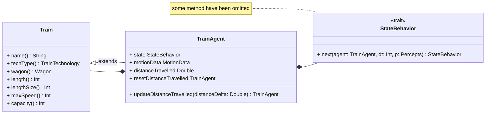
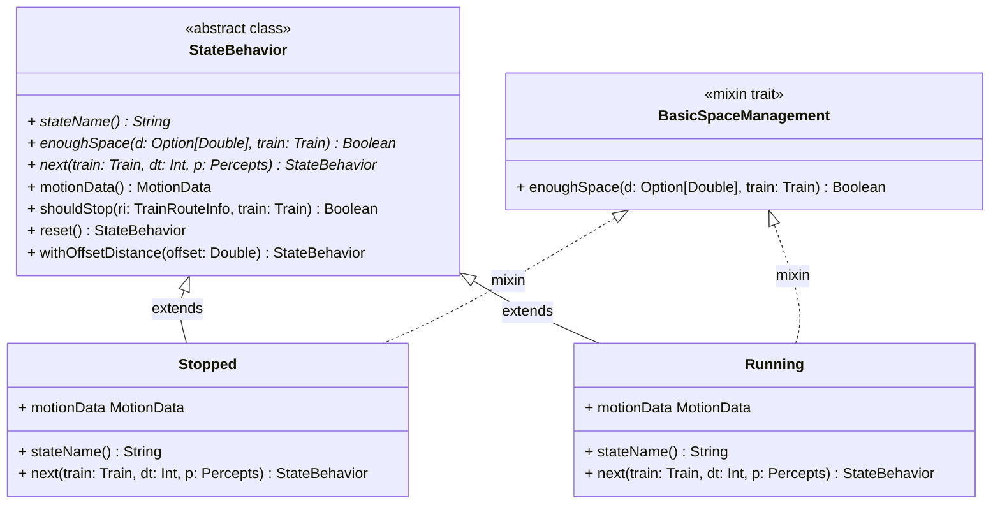
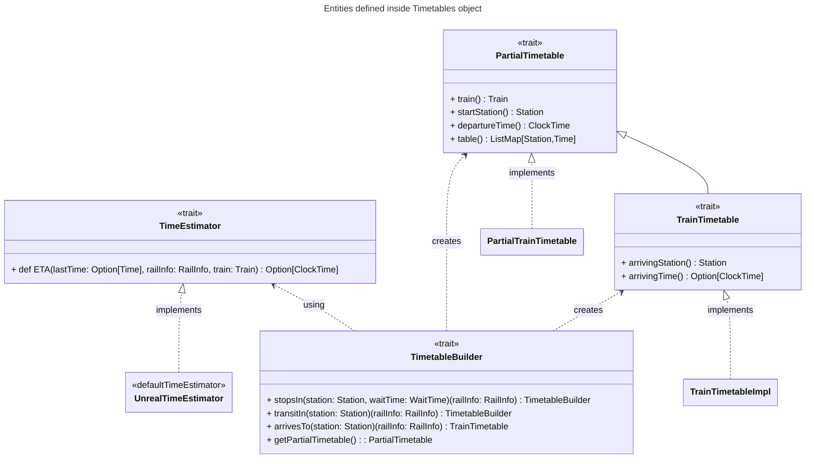

# Implementazione di Violani Matteo

## Parti implementate
Il mio contributo in questo progetto ha previsto lo sviluppo delle parti seguendo l'approccio TDD comportando il conseguente sviluppo dei relativi test. 

- __Train__: sviluppo delle entità `Train`, `Wagons` and `TrainTechnology`, dei relativi manager `TrainManager` e `TechnologyManager` e del `TrainService` con relativa porta `TrainPorts`.
- __TrainAgent__: sviluppo dell'entità dinamica della simulazione `TrainAgent` con collaborazione del collega Bravetti per l'allineamento e uso delle *percepts* del treno (`TrainAgentPerception`) ricevute dall'`RailwayEnvironment` da lui sviluppate all'interno dell'agente e delle sotto entità sviluppate.
- __TrainAgentState__: parte integrante del `TrainAgent` riguardante la dinamica del suo comportamento durante la simulazione e dell'aggiornamento dei dati dinamici `MotionData` anch'essi sviluppati.
- __Timetable__: sviluppo della definizione della tabella oraria statica del treno `Timetable` con annessa implementazione del `TimetableManager` e del servizio di `TimetableService` per la loro gestione. Per questa entità è stato anche definito un DSL per la creazione di una Timetable per un treno.
- __Times__: implementazione delle entità `ClockTime` e `Time` (con integrazioni di Federico Bravetti) per rappresentare il concetto di tempo con sfumature diverse  sia all'interno della simulazione che nella definizione delle tabelle orarie del treno.
- **Interfaccia utente** per la costruzione delle *Timetable* e creazione dei *Train*

Nello sviluppo del codice si è cercato di massimizzare l'uso di `trait` insieme al `companion-object` tenendo nascoste le effettive implementazioni sviluppate usando
invece class o case-class.

## Sviluppo funzionale ed immutabilità
Nello sviluppo si è cercato di abbracciare completamente la programmazione funzionale e per fare ciò si è fatto uso di `Option`, `Try` e specialmente di `Either` come tipo di ritorno dei metodi che modificano o aggiornano entità immutabili.

Analizzando per esempio il manager `TimetableManager` qualsiasi metodo che prevede l'aggiunta/cancellazione di una timetable o che tipicamente lancerebbe una eccezione restituisce un `Either[TimetableManagerErrors, TimetableManager]`. In questo modo viene sempre restituito qualcosa, che sia un errore che deve essere gestito o che sia il manager stesso aggiornato.

## Train

definizione e sviluppo della entità `Train` e di `TrainTechnology` (sottotipo di `Technology`), le classi come `Wagons` e `Train` non sono così entusiasmanti

## Train Agent


`TrainAgent` e il suo comportamento dinamico (FSM) in base ai percepts ricevuti (sviluppati dal collega Federico Bravetti)
  - MotionData: modellazione in una entità dedicata delle informazioni dinamiche del movimento del treno come *velocità*, *accelerazione* e *spazio percorso*.
  - `TrainAgentsStates` (concetto base `StateBehavior` con mixins trait per rendere modulare la logica di fermata con metodo `shouldStop` e il calcolo delle distanza di sicurezza fornita dal metodo `enoughSpace` del trait `SpaceManagement`)
  
    Avendo separato il concetto di comportamento (stato della FSM) dalla definzione del TrainAgent quest'ultimmo non ha la responsabilità di valutare quale sia lo stato successivo in cui passare ma è lo stato stesso, che a seguito della chiamata del metodo `next`, restituisce quello nuovo. 

    Lo stato corrente elabora lo stato successivo in base alle caratteristiche del `Train` associato all'agente, il `dt` e le `TrainAgentPerception` ricevute dall'environment (`RailwayEnvironment`, non rappresentato nell'uml).

    Di seguito si mostra il codice del metodo `doStep` del *TrainAgent*:
    ``` scala 3
    override def doStep(dt: Int, simulationEnvironment: RailwayEnvironment): TrainAgent =
        import ulisse.entities.simulation.environments.railwayEnvironment.PerceptionProviders.given
        val perception: Option[TrainAgentPerception[?]] = simulationEnvironment.perceptionFor[TrainAgent](this)
        copy(state = state.next(this, dt, perception))
    ```

### TrainAgentStates

Lo State del TrainAgent è uno `StateBehavior` che come si può vedere dall'UML è una classe astratta in cui i metodi `enoughSpace`, `stationName` e `next` la cui implementazione verrà definita in una classe specifica. Ciascun state behavior è caratterizzato dal *nome* e la *logica di transizione* ad un nuovo stato.





## Timetable
Nella costruzione della `Timetable` si è fatto uso del meccanismo delle **given instance** per  il calcolo del tempo stimato di arrivo (*ETA - Estimation Time of Arrivial*) in una stazione conoscendo l'orario di partenza di quella precendete, la velocità del treno e le caratteristiche della route su cui viaggia.

Il trait che definisce il metodo di stima è il seguente:
``` scala
  trait TimeEstimator:
    /** Return optionally arrival ClockTime to travel rail length ([[railInfo.length]]) */
    def ETA(lastTime: Option[StationTime], railInfo: RailInfo, train: Train): Option[ClockTime]
```

All'interno dell'oggetto `Timetables` viene fornita una implementazione di default, `defaultTimeEstimator`, che considera unicamente velocità del treno più compatibile con quella della rotaia e la lunghezza delle rotaie. Non vengono considerate le accelerazioni.

```scala 
  given defaultTimeEstimator: TimeEstimator = UnrealTimeEstimator
```
``` scala 
  /** Default implementation of [[TimeEstimator]]
    * It uses minimum speed between train and rail ones; it doesn't consider train's acceleration and deceleration specs
    */
  private object UnrealTimeEstimator extends TimeEstimator:
    def ETA(lastTime: Option[StationTime], railInfo: RailInfo, train: Train): Option[ClockTime] =
      val travelMinutes =
        (railInfo.length / Math.min(train.maxSpeed, railInfo.typeRoute.technology.maxSpeed) * 60).toInt

      for
        offsetTime      <- lastTime
        travelStartTime <- offsetTime.departure
        arrivingTime    <- (Id(travelStartTime.asTime) + Id(Time(0, travelMinutes, 0))).toClockTime.toOption
      yield arrivingTime
```

> **NOTA** Anche all'interno di `TimetableManager` è stata definita una *contextual given* per definire la policy di accettazione per una timetable (`AcceptanceTimetablePolicy`) che deve essere salvata.

Di seguito viene mostrato uno schema UML riassuntivo dei trait definiti all'intenro dell'oggetto `Timetables`.



## DSL per la dichiarazione di una Timetable

Per la creazione del DSL (reperibile nel package `dsl`) è stato fatto uso di ***case class***, ***extension method*** e ***costruttori fluenti***. Queste rendono più fluente e leggibile la costruzione di una `Timetable` per un treno mascherando il `TimetableBuilder` sottostante.

Una volta indicato il treno, l'ora di partenza e la stazione di partenza, occorre specificare le informazioni della route per raggiungere la stazione seguente.

> _train_name_ **at** _clock_time_ **startFrom** _station1_ **thenOnRail** _rail_info1_ [**stopsIn** or **travelsTo**] _station2_ **thenOnRail** ... _rail_infoX_ **arrivesTo** _stationY_
> 
In una stazione è possibile:
- raggiungere e sostare per un certo numero di minuti con "**stopsIn** _station_ waitingForMinutes _x_"
- solo transitare con: "**travelsTo** _station_"

Per finalizzare la costruzione basta indicare la stazione di arrivo con "**arrivesTo** _stationF_"

Di seguito si mostra il codice per la costruzione di una *timetable* utilizando il DSL creato e la corrispettiva costruzione con il builder.

Risultato finale ottenuto grazie al dsl.
```scala 3
AV1000Train at h(9).m(0).getOrDefault startFrom stationA thenOnRail
  railAV_10 stopsIn stationB waitingForMinutes 5 thenOnRail
  railAV_10 travelsTo stationC thenOnRail
  railAV_10 stopsIn stationD waitingForMinutes 10 thenOnRail
  railAV_10 arrivesTo stationF
```

Utilizzando il builder in modo classico:
```scala 3
TimetableBuilder(train = AV1000Train, startStation = stationA, departureTime = h(9).m(0).getOrDefault)
  .stopsIn(stationB, waitTime = 5)(railAV_10)
  .transitIn(stationC)(railAV_10)
  .stopsIn(stationD, waitTime = 10)(railAV_10)
  .arrivesTo(stationF)(railAV_10)
```
