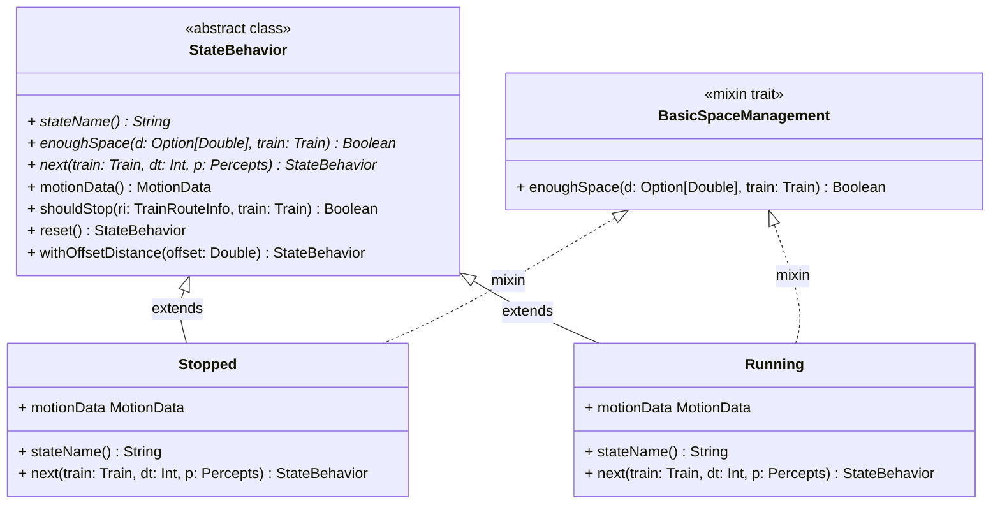
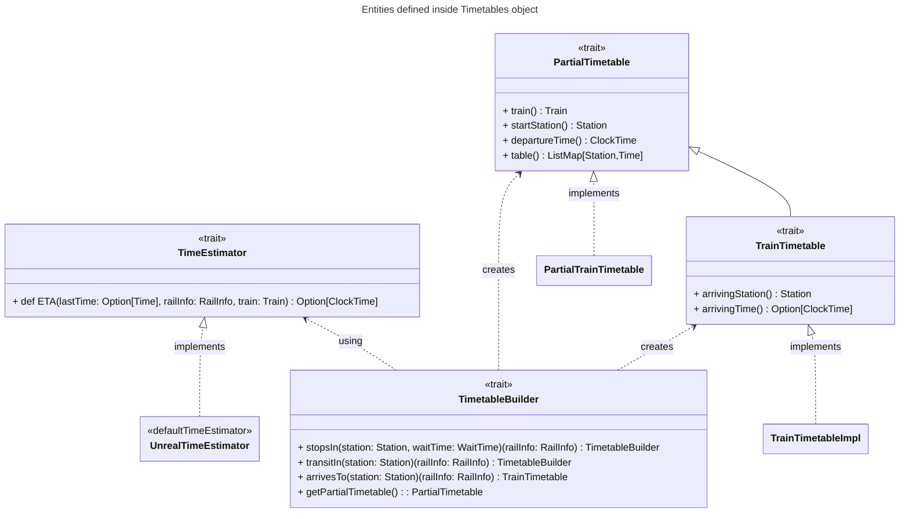

# Implementazione di Violani Matteo

## Parti implementate
Il mio contributo in questo progetto ha previsto lo sviluppo delle parti seguendo l'approccio TDD comportando il conseguente sviluppo dei relativi test. 

- __Train__: sviluppo delle entità `Train`, `Wagons` and `TrainTechnology`, dei relativi manager `TrainManager` e `TechnologyManager` e del `TrainService` con relativa porta `TrainPorts`.
- __TrainAgent__: sviluppo dell'entità dinamica della simulazione `TrainAgent` con collaborazione del collega Bravetti per l'allineamento e uso delle *percepts* del treno (`TrainAgentPerception`) ricevute dall'`RailwayEnvironment` da lui sviluppate all'interno dell'agente e delle sotto entità sviluppate.
- __TrainAgentState__: parte integrante del `TrainAgent` riguardante la dinamica del suo comportamento durante la simulazione e dell'aggiornamento dei dati dinamici `MotionData` anch'essi sviluppati.
- __Timetable__: sviluppo della definizione della tabella oraria statica del treno `Timetable` con annessa implementazione del `TimetableManager` e del servizio di `TimetableService` per la loro gestione. Per questa entità è stato anche definito un DSL per la creazione di una Timetable per un treno.
- __Times__: implementazione delle entità `ClockTime` e `Time` (con integrazioni di Federico Bravetti) per rappresentare il concetto di tempo con sfumature diverse  sia all'interno della simulazione che nella definizione delle tabelle orarie del treno.
- **Interfaccia utente** per la costruzione delle *Timetable* e creazione dei *Train*

Nello sviluppo del codice si è cercato di massimizzare l'uso di `trait` insieme al `companion-object` tenendo nascoste le effettive implementazioni sviluppate usando
invece class o case-class.

## Sviluppo funzionale ed immutabilità
Nello sviluppo si è cercato di abbracciare completamente la programmazione funzionale e per fare ciò si è fatto uso di `Option`, `Try` e specialmente di `Either` come tipo di ritorno dei metodi che modificano o aggiornano entità immutabili.

Analizzando per esempio il manager `TimetableManager` qualsiasi metodo che prevede l'aggiunta/cancellazione di una timetable o che tipicamente lancerebbe una eccezione restituisce un `Either[TimetableManagerErrors, TimetableManager]`. In questo modo in caso d'errore viene sempre ritornata la causa, mentre in caso di successo della richiesta viene restituito il manager aggiornato. Attraverso `match-case` è possibile distinguere l'errore e agire di conseguenza.

Di seguito si mostrano gli errori specifici del `TimetableManager`:

```scala 3
/** Errors that can returned by manager */
  trait TimetableManagerErrors extends BaseError
  object TimetableManagerErrors:
    final case class AcceptanceError(reason: String) extends ErrorMessage(s"Timetable not approved: $reason")
        with TimetableManagerErrors
    final case class TimetableNotFound(trainName: String)
        extends ErrorNotExist(s"No timetables exist for train $trainName") with TimetableManagerErrors
    final case class DeletionError(descr: String) extends ErrorMessage(s"Delete error: $descr")
        with TimetableManagerErrors
    final case class StationNotFound() extends ErrorNotExist(s"some station not found") with TimetableManagerErrors
    final case class DuplicatedStations(stations: Seq[Station])
        extends ErrorMessage(s"Timetable has duplicated stations: $stations")
        with TimetableManagerErrors
```

### TrainAgentStates
Come già introdotto del capitolo di design il comportamento del `TrainAgent` è stato modellato come FSM. La classe astratta `StateBehavior` rappresenta la classe base per la creazione di un nuovo stato della FSM. Di seguito viene riportata la definizione della classe `StateBehavior`:

``` scala 3
abstract class StateBehavior:
    def motionData: MotionData
    def stateName: String
    def enoughSpace(d: Option[Double], train: Train): Boolean
    def shouldStop(ri: TrainRouteInfo, train: Train): Boolean =
      !enoughSpace(ri.trainAheadDistance, train) || !ri.arrivalStationIsFree

    def reset(): StateBehavior = Stopped(MotionDatas.emptyMotionData)

    def withOffsetDistance(offset: Double): StateBehavior = this match
      case Stopped(md) => Stopped(md.withDistanceOffset(offset))
      case Running(md) => Running(md.withDistanceOffset(offset))

    def next(train: Train, dt: Int, p: Percepts): StateBehavior
```
Attraverso il meccanismo dei mixins trait è stato possibile rendere modulare la logica di stop basato sulla distanza del treno . Il metodo `shouldStop` utilizza il metodo astratto `enoughSpace` che viene implementato dal trait `BasicSpaceManagement`.

Al momento sono stati definiti solo i due stati `Running` e `Stopped` ma è possbile definirne altri semplicemente creando una classe che estende `StateBehavior` mixandola, ad esempio, con il comportamento `BasicSpaceManagement` mostrato in seguito.

```scala 3
 trait BasicSpaceManagement extends StateBehavior:
    private val defaultSpaceLimit = 20
    def enoughSpace(d: Option[Double], train: Train): Boolean =
      d.forall { availableSpace => availableSpace >= defaultSpaceLimit }
```

Viene mostrata inoltre anche la definizione dello stato `Stopped` a titolo esemplificativo:

```scala 3
final case class Stopped(motionData: MotionData)
      extends StateBehavior with BasicSpaceManagement:
    override def stateName: String = "Stopped"

    override def next(train: Train, dt: Int, p: Percepts): StateBehavior =
      p.map {
        // train on route have no train ahead or arrival station is free
        case TrainPerceptionInRoute(p) if !shouldStop(p, train) =>
          val speed = Math.min(p.routeTypology.technology.maxSpeed, train.maxSpeed)
          Running(motionData.withSpeed(speed).updated(dt))
        // train stopped in station starts and run on route
        case TrainPerceptionInStation(p) if p.hasToMove && p.routeTrackIsFree =>
          Running(motionData.withSpeed(train.maxSpeed).updated(dt))
        case _ => this
      }.getOrElse(this)
```

Si noti come, in questo modo, il `TrainAgent` sia totalmente all'oscuro di come venga elaborato lo stato successivo se non chiamare il metodo `next` che restituisce uno stato nuovo in via del tutto immutabile. 

Ciascuno stato è caratterizzato dalla *logica di transizione* interna che elabora lo stato successivo sulla base delle caratteristiche del `Train` associato all'agente, del `dt` e dei `TrainAgentPerception` ricevuti dall'environment `RailwayEnvironment` (non rappresentato nell'uml).




Di seguito si mostra il codice del metodo `doStep` del *TrainAgent*:
``` scala 3
override def doStep(dt: Int, simulationEnvironment: RailwayEnvironment): TrainAgent =
    import ulisse.entities.simulation.environments.railwayEnvironment.PerceptionProviders.given
    val perception: Option[TrainAgentPerception[?]] = simulationEnvironment.perceptionFor[TrainAgent](this)
    copy(state = state.next(this, dt, perception))
```

## Timetable
Nella costruzione della `Timetable` si è fatto uso del meccanismo delle **given instance** per  il calcolo del tempo stimato di arrivo (*ETA - Estimation Time of Arrivial*) in una stazione conoscendo l'orario di partenza di quella precendete, la velocità del treno e le caratteristiche della route su cui viaggia.

Il trait che definisce il metodo di stima è il seguente:
``` scala
  trait TimeEstimator:
    /** Return optionally arrival ClockTime to travel rail length ([[railInfo.length]]) */
    def ETA(lastTime: Option[StationTime], railInfo: RailInfo, train: Train): Option[ClockTime]
```

All'interno dell'oggetto `Timetables` viene fornita una implementazione di default, `defaultTimeEstimator`, che considera unicamente velocità del treno più compatibile con quella della rotaia e la lunghezza delle rotaie. Non vengono considerate le accelerazioni.

```scala 3
  given defaultTimeEstimator: TimeEstimator = UnrealTimeEstimator
```
```scala 3
  /** Default implementation of [[TimeEstimator]]
    * It uses minimum speed between train and rail ones; it doesn't consider train's acceleration and deceleration specs
    */
  private object UnrealTimeEstimator extends TimeEstimator:
    def ETA(lastTime: Option[StationTime], railInfo: RailInfo, train: Train): Option[ClockTime] =
      val travelMinutes =
        (railInfo.length / Math.min(train.maxSpeed, railInfo.typeRoute.technology.maxSpeed) * 60).toInt

      for
        offsetTime      <- lastTime
        travelStartTime <- offsetTime.departure
        arrivingTime    <- (Id(travelStartTime.asTime) + Id(Time(0, travelMinutes, 0))).toClockTime.toOption
      yield arrivingTime
```

> **NOTA** Anche all'interno di `TimetableManager` è stata definita una *contextual given* per definire la policy di accettazione per una timetable (`AcceptanceTimetablePolicy`) che deve essere salvata.

Di seguito viene mostrato uno schema UML riassuntivo dei trait definiti all'interno dell'oggetto `Timetables` in cui è definito il builder e le classi riguardanti la timetable.



## DSL per la dichiarazione di una Timetable

Per la creazione del DSL (reperibile nel package `dsl`) si è fatto uso di ***case class***, ***extension method*** e ***costruttori fluenti***. Queste rendono più fluente e leggibile la costruzione di una `Timetable` per un treno mascherando il `TimetableBuilder` sottostante.

Una volta indicato il treno, l'ora di partenza e la stazione di partenza, occorre specificare le informazioni della route per raggiungere la stazione seguente.

> _train_name_ **at** _clock_time_ **startFrom** _station1_ **thenOnRail** _rail_info1_ [**stopsIn** or **travelsTo**] _station2_ **thenOnRail** ... _rail_infoX_ **arrivesTo** _stationY_
> 
In una stazione è possibile:
- raggiungere e sostare per un certo numero di minuti con "**stopsIn** _station_ waitingForMinutes _x_"
- solo transitare con: "**travelsTo** _station_"

Per finalizzare la costruzione basta indicare la stazione di arrivo con "**arrivesTo** _stationF_"

Di seguito si mostra il codice per la costruzione di una *timetable* utilizando il DSL creato e la corrispettiva costruzione con il builder.

Risultato finale ottenuto grazie al dsl.
```scala 3
AV1000Train at h(9).m(0).getOrDefault startFrom stationA thenOnRail
  railAV_10 stopsIn stationB waitingForMinutes 5 thenOnRail
  railAV_10 travelsTo stationC thenOnRail
  railAV_10 stopsIn stationD waitingForMinutes 10 thenOnRail
  railAV_10 arrivesTo stationF
```

Utilizzando il builder in modo classico:
```scala 3
TimetableBuilder(train = AV1000Train, startStation = stationA, departureTime = h(9).m(0).getOrDefault)
  .stopsIn(stationB, waitTime = 5)(railAV_10)
  .transitIn(stationC)(railAV_10)
  .stopsIn(stationD, waitTime = 10)(railAV_10)
  .arrivesTo(stationF)(railAV_10)
```
## Time e ClockTime 
L'entità `ClockTime` è una specializzazione di `Time` con le seguenti caratteristiche:
- le ore possono assumere valori compresi tra `0` e `23`
- i minuti possono assumere valori compresi tra `0` e `59`

Come si può vedere nel costruttore di `ClockTime` sottostante, solo in caso di valori validi l'entità viene creata, diversamente viene restituito un `ClockTimeErrors` che può essere `InvalidHours` o `InvalidMinutes`.

```scala 3
def apply(h: Hour, m: Minute): Either[ClockTimeErrors, ClockTime] =
  val time = Id(Time(0, 0, 0)) overflowSum Id(Time(h, m, ignoredSecondValue))
  for
    h <- ValidationUtils.validateRange(h, minDayHours, maxDayHours, InvalidHours(time))
    m <- ValidationUtils.validateRange(m, minDayMinutes, maxDayMinutes, InvalidMinutes(time))
  yield ClockTimeImpl(h, m)
```

Oltre al costruttore viene fornito l'extension method `getOrDefault` permette di restituire un `ClockTime` di default calcolato secondo la strategia `DefaultTimeStrategy` fornita dal contesto.

Di seguito si riporta il codice:
``` scala 3
  trait DefaultTimeStrategy:
    /** Given a `currentTime` returns a default one. */
    def defaultTime(currentTime: Time): Time

  private object FixedTimeDefault extends DefaultTimeStrategy:
    override def defaultTime(currentTime: Time): Time = Time(0, 0, ignoredSecondValue)

  /** Default given instance of DefaultTimeStrategy */
  given predefinedDefaultTime: DefaultTimeStrategy = FixedTimeDefault

  extension (time: Either[ClockTimeErrors, ClockTime])
    /** Returns a default ClockTime using [[DefaultTimeStrategy]] for calculation of default ClockTime. */
    def getOrDefault(using dts: DefaultTimeStrategy): ClockTime =
      time match
        case Left(e) =>
          val dTime = dts.defaultTime(e.time)
          ClockTimeImpl(dTime.h, dTime.m)
        case Right(ct) => ct
```

Si è cercato di rendere la costruzione di un `ClockTime` più leggibile e intuitiva cercando di creare, senza successo, un piccolo DSL per ottenere un risultato simile a `HH h MM m` con `HH` e `MM` i valori.

Di seguito viene mostrata l'implementazione provata:

```scala 3
object FluentDeclaration:
  case class HoursBuilder(hours: Int)

  infix def h(h: Int): HoursBuilder = HoursBuilder(h)

  extension (hb: HoursBuilder)
    /** Returns ClockTime with `minutes` and previous given hours */
    def m(minutes: Int): Either[ClockTimeErrors, ClockTime] = ClockTime(hb.hours, minutes)

```
