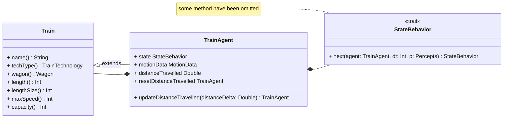
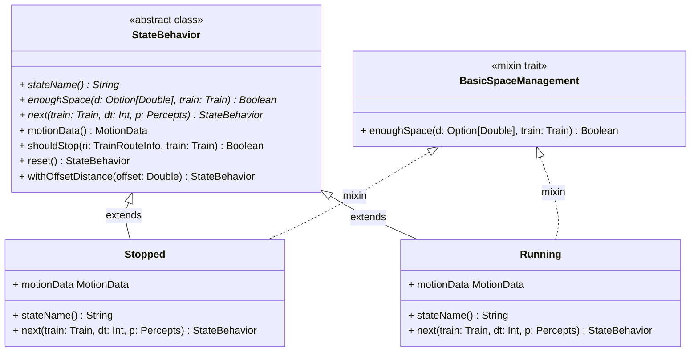
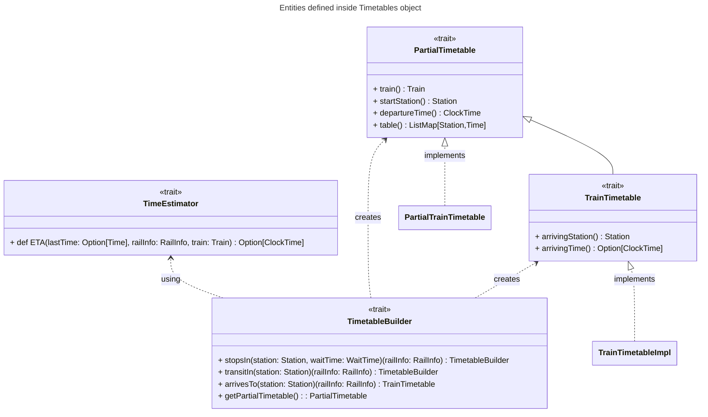

# Implementazione di Violani Matteo


## Train & Technology
- definizione e sviluppo della entità `Train` e di `TrainTechnology` (sottotipo di `Technology`), le classi come `Wagons` e `Train` non sono così entusiasmanti

## Train Agent



- `TrainAgent` e il suo comportamento dinamico (FSM) in base ai percepts ricevuti (sviluppati dal collega Federico Bravetti)
  - MotionData: modellazione in una entità dedicata delle informazioni dinamiche del movimento del treno come *velocità*, *accelerazione* e *spazio percorso*.
  - `TrainAgentsStates` (concetto base `StateBehavior` con mixins trait per rendere modulare la logica di fermata con metodo `shouldStop` e il calcolo delle distanza di sicurezza fornita dal metodo `enoughSpace` del trait `SpaceManagement`)
  
    Avendo separato il concetto di comportamento (stato della FSM) dalla definzione del TrainAgent quest'ultimmo non ha la responsabilità di valutare quale sia lo stato successivo in cui passare ma è lo stato stesso, che a seguito della chiamata del metodo `next`, restituisce quello nuovo. 

    Lo stato corrente elabora lo stato successivo in base alle caratteristiche del `Train` associato all'agente, il `dt` e le `TrainAgentPerception` ricevute dall'environment (`RailwayEnvironment`, non rappresentato nell'uml).

    Di seguito si mostra il codice del metodo `doStep` del *TrainAgent*:
    ``` scala 3
    override def doStep(dt: Int, simulationEnvironment: RailwayEnvironment): TrainAgent =
        import ulisse.entities.simulation.environments.railwayEnvironment.PerceptionProviders.given
        val perception: Option[TrainAgentPerception[?]] = simulationEnvironment.perceptionFor[TrainAgent](this)
        copy(state = state.next(this, dt, perception))
    ```

### TrainAgentStates

Lo State del TrainAgent è uno `StateBehavior` che come si può vedere dall'UML è una classe astratta in cui i metodi `enoughSpace`, `stationName` e `next` la cui implementazione verrà definita in una classe specifica. Ciascun state behavior è caratterizzato dal *nome* e la *logica di transizione* ad un nuovo stato.





## Timetable




- sviluppo della entità in se, con metologia TDD
- 

### Creazione DSL per la definizione di una Timetable
Risultato finale ottenuto grazie al dsl.
```scala 3
AV1000Train at h(9).m(0).getOrDefault startFrom stationA thenOnRail
  railAV_10 andStopIn stationB waitingForMinutes 5 thenOnRail
  railAV_10 travelsTo stationC thenOnRail
  railAV_10 andStopIn stationD waitingForMinutes 10 thenOnRail
  railAV_10 arrivesTo stationF
```

Utilizzando il builder in modo classico:
```scala 3
TimetableBuilder(train = AV1000Train, startStation = stationA, departureTime = h(9).m(0).getOrDefault)
  .stopsIn(stationB, waitTime = 5)(railAV_10)
  .transitIn(stationC)(railAV_10)
  .stopsIn(stationD, waitTime = 10)(railAV_10)
  .arrivesTo(stationF)(railAV_10)
```